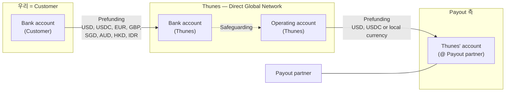

# Thunes Funds Flow (자금 흐름 / Prefunding 모델) 정리

> 출처: `Pay Functional & Technical Overview.pdf` 내 **"Funds Flow"** 다이어그램.
> 정보 흐름(API 호출)과 별개로, **실제 자금이 어떻게 선충전(prefunding)되고 이동하는지**를 정리한다.
> 관련: [Thunes_정보흐름_information-flow.md](./Thunes_정보흐름_information-flow.md)

---

## 1. 핵심 개념 — Prefunding(선충전) 모델

Thunes 는 **선충전 방식**이다. 거래 시점에 실시간으로 돈을 보내는 게 아니라,
**우리(Customer)가 Thunes 계좌에 미리 자금을 충전**해 두고, 송금 건마다 그 잔액에서 차감된다.

- **Forecast**(예측): 충전/유동성 관리를 위한 캐시 포워캐스팅.
- **Safeguarding**(고객자금 보호): Thunes Bank account 의 고객 자금을 Operating account 와 분리·보호(규제 요건).

---

## 2. 자금 이동 단계

| 구간 | 방향 | 통화 | 의미 |
|---|---|---|---|
| **① 우리 → Thunes** | `Bank account(Customer)` → `Bank account(Thunes)` | **USD, USDC, EUR, GBP, SGD, AUD, HKD, IDR** | 우리가 Thunes 에 **선충전**. (USDC = 스테이블코인) |
| **② Thunes 내부** | `Bank account(Thunes)` ⤳ `Operating account(Thunes)` | — | **Safeguarding** 분리 보관 후 운영계좌로. |
| **③ Thunes → Payout** | `Operating account(Thunes)` → `Thunes' account(@Payout partner)` | **USD, USDC or local currency** | 도착국 지급 파트너 쪽 Thunes 계좌로 선충전. |
| **지급** | `Payout partner` → 수취인 | 로컬통화 | 파트너가 수취인 계좌로 크레딧(정보흐름의 마지막 단계). |

> 선충전 통화(우리→Thunes): **USD · USDC · EUR · GBP · SGD · AUD · HKD · IDR**
> 지급측 충전 통화(Thunes→Payout): **USD · USDC · 또는 로컬통화**

---

## 3. 개발/운영 관점 함의

- **잔액(Balance) 의존**: 송금은 우리의 **선충전 잔액에서 차감**된다.
  → 잔액 부족 시 거래 실패. **`GET /v2/money-transfer/balances`** 로 통화별 잔액 모니터링 필수.
- **통화별 잔액 관리**: 위 8개 통화로 충전 가능 → 코리도/도착통화에 맞춰 어떤 통화로 충전·보유할지 **유동성 전략** 필요.
- **Forecast / 보충(replenishment)**: 거래량 예측 기반으로 선제 충전. 잔액 소진 = 서비스 중단이므로 **임계치 알림** 권장.
- **정산/대사(reconciliation)**: 선충전액 ↔ 실제 차감(송금)액 대사. 우리 GW 는 자금을 직접 들고 있지 않고 **Thunes 잔액을 차감**시키는 구조.
- **Safeguarding**: 고객 자금 보호는 Thunes 측 규제 책임. 우리는 충전 주체.

---

## 4. 정보 흐름과의 관계

- **정보 흐름**(Quotation→Transaction→Confirm→Callback)은 "거래 지시", **자금 흐름**(Prefunding)은 "실제 돈".
- Confirm(③) 시점에 **선충전 잔액에서 해당 거래 금액이 차감**되고, 도착측은 Thunes 가 미리 충전해 둔 파트너 계좌에서 지급.
- 즉 **실시간 송금처럼 보이지만 내부적으로는 양쪽 모두 선충전된 잔액 간 정산**이다.

---

## 5. 금액 타입 메모

- 충전/지급 통화가 **소수 자릿수가 제각각**(예: USD/EUR 2자리, IDR 사실상 0자리, USDC 등)이라,
  금액은 **정수(Integer) 금지** — 통화별 정밀도를 보존하는 **`BigDecimal`**(또는 문자열 패스스루)로 다뤄야 한다.
- DTO 의 금액 필드(`Money.amount`, `*.retailFee`)는 이 원칙에 맞춰 정리한다. (코드 반영됨)
