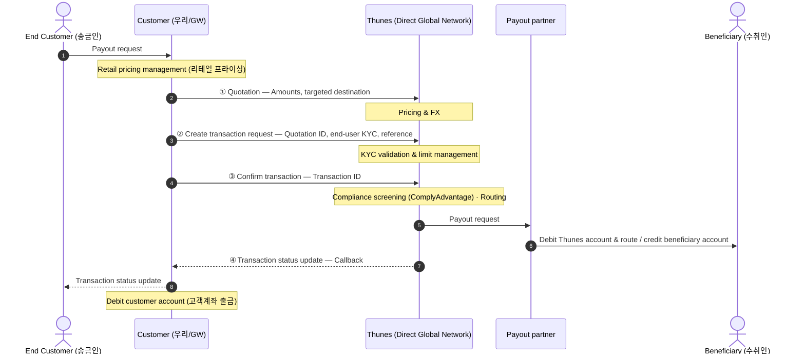

# Thunes Information Flow (정보 흐름) 정리

> 출처: `Pay Functional & Technical Overview.pdf` 내 **"Information flow"** 다이어그램.
> Thunes **Direct Global Network** 송금 happy-path 의 참여자/단계/책임 분담을 정리한다.

---

## 1. 참여자(Actors)

| 참여자 | 다이어그램 표기 | 설명 |
|---|---|---|
| **End Customer** | (좌측 사람) | 실제 송금 의뢰 고객(엔드유저). 우리 서비스 이용자. |
| **Customer (= 우리)** | `Customer` | **Thunes 의 고객 = 우리(파트너)**. = 우리 GW/플랫폼. 리테일 프라이싱·고객계좌 출금 담당. |
| **Thunes** | `Thunes — Direct Global Network` | 송금 네트워크. Pricing&FX / KYC·한도 / 컴플라이언스 / 라우팅 수행. |
| **Payout partner** | `Payout partner` | 도착국 지급 파트너(은행/월렛 등). |
| **Beneficiary** | (우측 사람) | 최종 수취인. |

> ⚠️ 용어 주의: 다이어그램의 `Customer` 박스는 **엔드유저가 아니라 "Thunes 입장에서의 고객 = 우리"** 다. 좌측 사람이 진짜 엔드유저(송금인).

---

## 2. 시퀀스

---

## 3. 단계별 상세

| # | 호출 | 요청 핵심 | Thunes 측 처리 |
|---|------|-----------|----------------|
| **①** | **Quotation** (견적) | Amounts(금액), targeted destination(도착지) | **Pricing & FX** — 환율/가격 산정·고정 |
| **②** | **Create transaction request** (거래 생성) | **Quotation ID**, **end-user KYC**, reference | **KYC validation & limit management** — 엔드유저 KYC 검증·한도 관리 |
| **③** | **Confirm transaction** (거래 확정) | **Transaction ID** | **Compliance screening**(ComplyAdvantage) · **Routing** — 제재/컴플라이언스 심사 후 라우팅 |
| **④** | **Transaction status update** (상태 통지) | — | **Callback** 으로 우리에게 상태 비동기 통지 |

### 우리(Customer) 측 책임
- **Payout request 수신**: 엔드유저 → 우리
- **Retail pricing management**: 우리 마크업/리테일 수수료 산정
- **Transaction status update 전달**: Thunes 콜백 → 엔드유저에게 반영
- **Debit customer account**: 엔드유저 고객계좌 출금

### 지급(Payout) 측
- Thunes → **Payout partner** 로 Payout request
- Payout partner: **Thunes 계좌 차감 후 수취인 계좌로 라우팅/크레딧**

---

## 4. 핵심 포인트 (개발 관점)

- **공식 happy-path 는 3 API 콜**: ① Quotation → ② Create transaction → ③ Confirm. 이후 ④ Callback 으로 상태 수신.
- **KYC·한도(limit management) 는 Thunes 측이 ② 단계에서 수행** — 요청에 **end-user KYC** 를 실어 보냄.
  - 단, **우리 자체 정책상 고객 한도 누적액 검증**(국내 외환/내부 한도)은 별도로 ②번 호출 **전에** 우리(API 서버)가 수행할 수 있음. (Thunes 한도 ≠ 우리 규제 한도)
- **수취인 검증(credit-party-verification)** 은 이 공식 흐름엔 명시 안 됨 → **선택적 사전검증**(거래 실패 줄이는 용도)으로 ② 전에 끼우는 옵션.
- **Compliance screening 은 ③ Confirm 시점** 에 수행(ComplyAdvantage). 즉 확정 전까지 제재심사 통과 보장 안 됨.
- **end-to-end 비동기**: 실제 지급 결과는 ④ Callback 으로만 확정 → 콜백 수신 엔드포인트 필수.

---

## 5. 우리 GW 구현 매핑

| 다이어그램 단계 | GW 인바운드 엔드포인트 | Provider 메서드 |
|---|---|---|
| ① Quotation | `POST /v1/thunes/quotations` | `createQuotation` |
| (선택) 수취인 검증 | `POST /v1/thunes/payers/{payerId}/{type}/credit-party-verification` | `verifyBeneficiary` |
| ② Create transaction | `POST /v1/thunes/quotations/{quotationId}/transactions` | `createTransaction` |
| ③ Confirm transaction | `POST /v1/thunes/transactions/{transactionId}/confirm` | `confirmTransaction` |
| ④ Status update (Callback) | `POST /webhooks/thunes/transactions` | `ThunesCallbackController` |

> 견적/거래/확정을 **개별 단계로 분리**해 둔 이유가 이 흐름과 맞물린다 — 우리(API 서버)가 ②번 전에 자체 한도검증/수취인검증을 끼워 제어하기 위함. (`ThunesRemittanceProvider` 참조)

---

### 관련 문서
- [Thunes_Pay_개발가이드_정리.md](./Thunes_Pay_개발가이드_정리.md) — API 엔드포인트/페이로드/필드 상세
